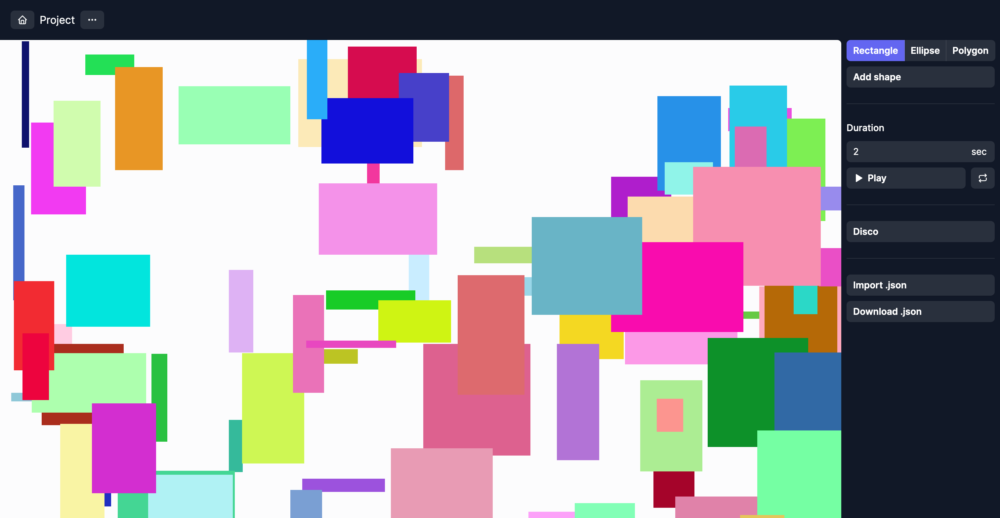

# wobble

[](https://github.com/prettier/prettier)
[](https://github.com/malcodeman/wobble/blob/master/LICENSE)

Motion design made simple.



## Getting started

```
git clone https://github.com/malcodeman/wobble.git
cd wobble
npm install
npm run dev
```

## License

[MIT](./LICENSE)
